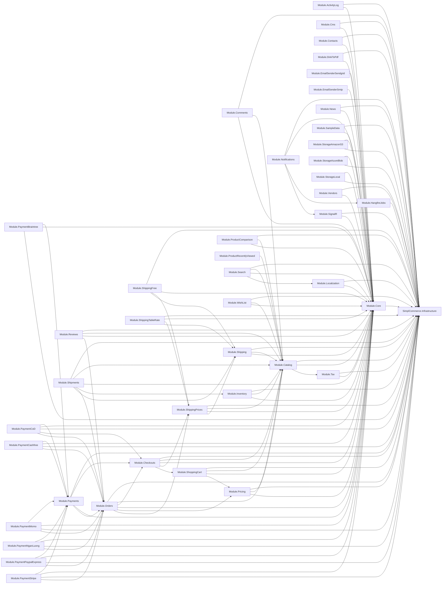

# Module Dependency Graph

> Trích xuất từ `<ProjectReference>` trong các `.csproj` dưới `src/Modules/` và `src/SimplCommerce.WebHost/`. Các ProjectReference ngoài SimplCommerce (Infrastructure, NuGet) giữ lại để nhìn rõ hạ tầng.

## Mermaid dependency graph (module → module)

## Topological order (suggested refactor order for Phase 2)

1. `Infrastructure` (base)
2. `Module.Core`
3. `Module.Localization`, `Module.ActivityLog`, `Module.Cms`, `Module.Tax`, `Module.Contacts`, `Module.Vendors`, `Module.SampleData`, `Module.News`, `Module.SignalR`, `Module.HangfireJobs`, `Module.DinkToPdf`, `Module.StorageLocal`, `Module.StorageAzureBlob`, `Module.StorageAmazonS3`, `Module.EmailSenderSendgrid`, `Module.EmailSenderSmtp`
4. `Module.Catalog` (depends on Tax)
5. `Module.Shipping`, `Module.Pricing`, `Module.Inventory`, `Module.Search`, `Module.Comments`, `Module.ProductComparison`, `Module.ProductRecentlyViewed`, `Module.WishList` (depend on Catalog)
6. `Module.ShippingPrices` (depends on Shipping + Catalog)
7. `Module.ShippingFree`, `Module.ShippingTableRate` (depend on ShippingPrices)
8. `Module.ShoppingCart` (depends on Catalog + Pricing)
9. `Module.Checkouts` (depends on Catalog + ShippingPrices + ShoppingCart)
10. `Module.Orders` (depends on Checkouts + Pricing + ShippingPrices)
11. `Module.Reviews`, `Module.Shipments` (depend on Orders)
12. `Module.Payments` (depends on Orders + Checkouts)
13. `Module.PaymentCoD`, `Module.PaymentMomo`, `Module.PaymentStripe`, `Module.PaymentPaypalExpress`, `Module.PaymentBraintree`, `Module.PaymentCashfree`, `Module.PaymentNganLuong`
14. `Module.Notifications` (depends on Hangfire + SignalR)

> Đây chính xác là thứ tự Phase 2 trong MIGRATION_TODO.md với điều chỉnh nhỏ để match thực tế dependencies (e.g., Tax trước Catalog).

## WebHost dependencies

`SimplCommerce.WebHost.csproj` references:
- SimplCommerce.Infrastructure
- Module.ActivityLog, Catalog, Checkouts, Cms, Comments, Contacts, Core
- Module.DinkToPdf, EmailSenderSmtp
- Module.Inventory, Localization, News, Orders
- Module.PaymentBraintree, PaymentCashfree, PaymentCoD, PaymentMomo, PaymentNganLuong, PaymentPaypalExpress, PaymentStripe, Payments
- Module.Pricing, ProductComparison, ProductRecentlyViewed, Reviews
- Module.SampleData, Search, Shipments
- Module.ShippingFree, ShippingPrices, ShippingTableRate, Shipping
- Module.ShoppingCart, StorageLocal, Tax, Vendors, WishList

> **Thiếu** trong WebHost refs: `Module.EmailSenderSendgrid`, `Module.HangfireJobs`, `Module.Notifications`, `Module.SignalR`, `Module.StorageAmazonS3`, `Module.StorageAzureBlob` — những module này có cơ chế runtime loading qua `modules.json` trong WebHost thay vì ProjectReference. Phase 2 (P2-39) sẽ chuyển tất cả về static project reference + extension method.
